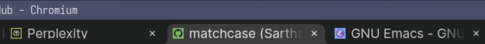

# DomainSquare
A solution to typosquatting that adds a unique, avalanche-sensitive color based on the domain and TLD to every website's favicon.

## FAQ
### What is this extension?
DomainSquare is a Manifest V3 extension that helps users distinguish between typosquatted domains by adding colors to website favicons that are very sensitive to small changes in the domain name.
### What is Typosquatting?
Typosquatting is when an often malicious third-party registers a domain name that is similar to the target website's domain name, and could be accidentally entered due to a typo - an example is gooogle.com (which now redirects to google.com).
### How does this extension work?
This program computes a color hash based on the domain name and top-level domain of a website. So for example, if the website is `subdomain.domain.tld/content`, the hash is computed on `domain.tld`. Internally, a hashing algorithm with avalanche sensitivity is mapped onto the HSL colorspace, which is then mapped onto the RGB colorspace before adding a colored square to the favicon.

## License
License - AGPLv3 or Later
© Sarthak Shah (matchcase), 2025
